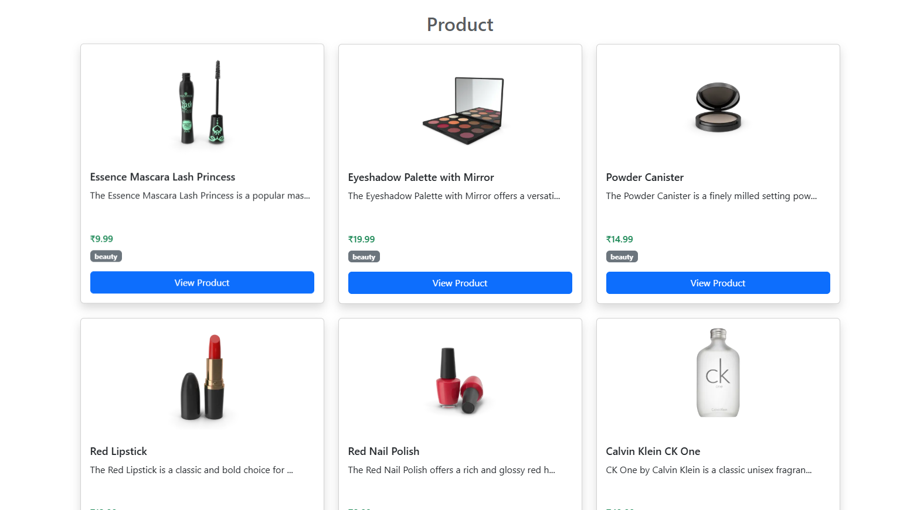
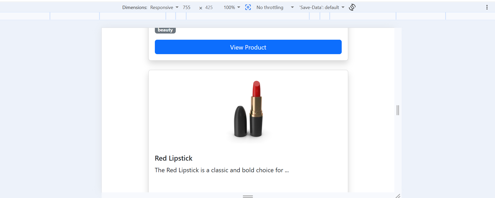

# 🛍️ Product Listing Application

## 🎥 Project Demonstration Video

**Video Explanation Link:**
(Add your YouTube/Drive video link here)

---
### Product Cards Section

### Responsive Mobile View

---

# 📌 Project Overview

The Product Listing Application is a modern web application built using React.js and Redux Toolkit. The application fetches product data from an external REST API and displays it in a responsive and user-friendly card layout.

This project demonstrates the implementation of Redux Toolkit for state management, asynchronous API handling using createAsyncThunk, and responsive UI design using Bootstrap.

The primary objective of this project is to understand how Redux Toolkit manages global state and how asynchronous data fetching can be handled efficiently in React applications.

---

# 🎯 Project Objectives

* Fetch product data from an external API.
* Manage application state using Redux Toolkit.
* Implement asynchronous actions using createAsyncThunk.
* Display products in a responsive card layout.
* Improve understanding of React Hooks and Redux architecture.
* Build a scalable and maintainable frontend application.

---

# ✨ Features

### Product Management

* Fetch product data from REST API.
* Display product image, title, description, and price.
* Responsive product card layout.
* Dynamic rendering of API data.
* Clean and user-friendly interface.

### State Management

* Global state management using Redux Toolkit.
* Async data handling with createAsyncThunk.
* Automatic UI updates when state changes.

### User Interface

* Bootstrap responsive design.
* Card-based product presentation.
* Mobile-friendly layout.
* Interactive hover effects.

---

# 🛠️ Technologies Used

| Technology        | Purpose              |
| ----------------- | -------------------- |
| React.js          | Frontend Development |
| Redux Toolkit     | State Management     |
| React Redux       | Redux Integration    |
| Axios             | API Requests         |
| Bootstrap 5       | UI Design            |
| DummyJSON API     | Product Data Source  |
| JavaScript (ES6+) | Application Logic    |

---

# 📡 API Integration

The application fetches data from the DummyJSON API.

API Endpoint:

https://dummyjson.com/products

Sample API Response:

* Product ID
* Product Title
* Product Description
* Product Price
* Product Category
* Product Thumbnail
* Product Rating

---

# 🏗️ Project Architecture

The application follows a component-based architecture.

Data Flow:

User Opens Application
↓
App Component Loads
↓
Redux Action Dispatched
↓
createAsyncThunk Executes
↓
API Request Sent
↓
Data Received
↓
Redux Store Updated
↓
UI Re-rendered Automatically

---

# 📂 Folder Structure

src/

├── app/
│   └── store.js
│
├── features/
│   └── Products/
│       └── ProductSlice.js
│
├── App.jsx
├── App.css
├── main.jsx
│
└── assets/
└── screenshots/

---

# ⚙️ Installation Guide

## Step 1: Clone Repository

git clone <repository-url>

## Step 2: Navigate to Project Directory

cd product-listing-app

## Step 3: Install Dependencies

npm install

## Step 4: Start Development Server

npm run dev

## Step 5: Open Browser

http://localhost:5173

---

# 🔄 Redux Toolkit Workflow

### 1. Store Configuration

The Redux store is configured using configureStore().

### 2. Slice Creation

A ProductSlice is created using createSlice() to manage product-related state.

### 3. Async Action

createAsyncThunk() is used to perform asynchronous API requests.

### 4. State Update

Once the API response is received, Redux updates the state automatically.

### 5. UI Rendering

React components subscribe to Redux state using useSelector() and re-render when data changes.

---

# 🧠 Concepts Implemented

* Functional Components
* React Hooks
* useEffect
* useDispatch
* useSelector
* Redux Toolkit
* createSlice
* createAsyncThunk
* Async API Calls
* Axios Integration
* State Management
* Responsive Design
* Dynamic Rendering
* Component Reusability

---

# 📈 Future Enhancements

The following features can be added in future versions:

* Product Details Page
* Search Functionality
* Product Filtering
* Category-Based Products
* Pagination
* Add to Cart
* Wishlist Feature
* Dark Mode
* Product Rating Display
* Sorting Functionality

---

# 🧪 Testing

The application has been tested for:

* Successful API Fetching
* Redux State Updates
* Responsive Design
* Product Rendering
* Error-Free Navigation

---

# 👩‍💻 Author

**Dhamanda Diya Hoshiyarsingh**

Frontend Developer

---

# 📜 License

This project is developed for educational and learning purposes. Free to use and modify.
